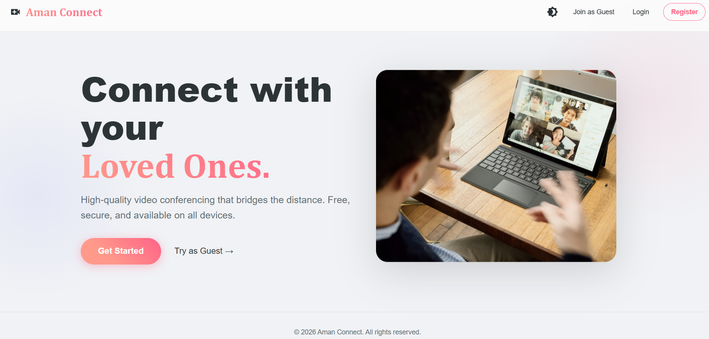
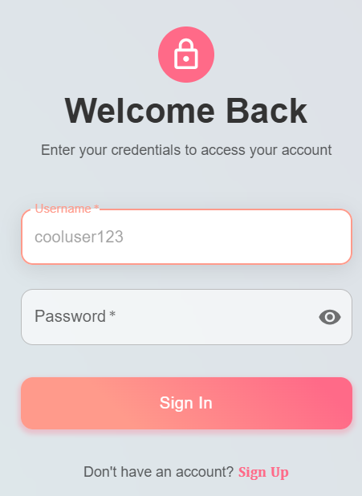
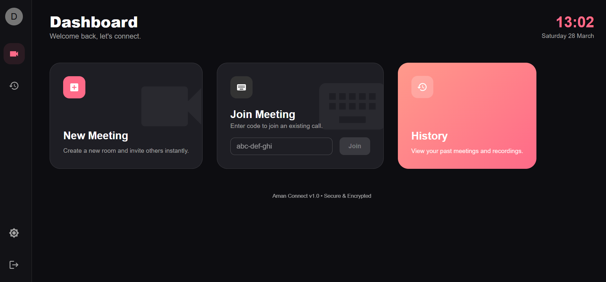
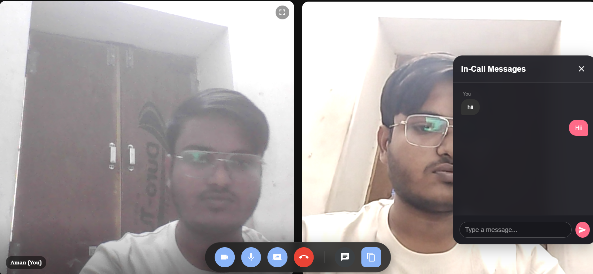
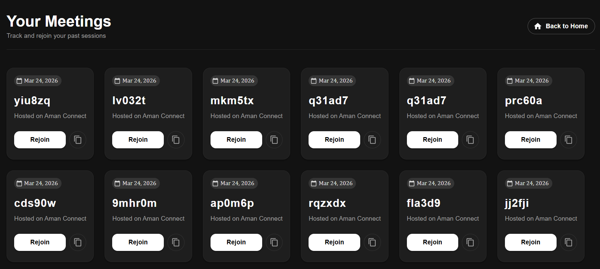

# AmanConnect

A full-stack video conferencing application built with the MERN stack, featuring real-time communication, user authentication, and meeting management.

## 🚀 Features

- **Real-time Video Conferencing**: High-quality video calls with multiple participants
- **Instant Messaging**: Real-time chat during meetings
- **User Authentication**: Secure login and registration system
- **Meeting Management**: Create, join, and manage video meetings
- **Meeting History**: Track past meetings and sessions
- **Guest Access**: Allow guests to join meetings without registration
- **Responsive Design**: Modern UI built with Material-UI
- **Dark/Light Theme**: Customizable theme support

## � Screenshots

### Landing Page

*The main landing page where users can get started with the application.*

### Authentication

*User login and registration interface.*

### Home Dashboard

*User dashboard showing meeting options and history.*

### Video Meeting

*Active video conference with chat panel.*

### Meeting History

*List of past meetings and sessions.*


## �🛠️ Tech Stack

### Backend
- **Node.js** - Runtime environment
- **Express.js** - Web framework
- **Socket.IO** - Real-time communication
- **MongoDB** - Database
- **Mongoose** - ODM for MongoDB
- **bcrypt** - Password hashing
- **JWT** - Authentication tokens

### Frontend
- **React** - UI library
- **Vite** - Build tool and dev server
- **Material-UI** - Component library
- **React Router** - Client-side routing
- **Socket.IO Client** - Real-time communication
- **Axios** - HTTP client

## 📋 Prerequisites

Before running this application, make sure you have the following installed:

- **Node.js** (v16 or higher)
- **MongoDB** (local or cloud instance)
- **npm** or **yarn** package manager

## 🔧 Installation

1. **Clone the repository**
   ```bash
   git clone <repository-url>
   cd Aman-Connect
   ```

2. **Install backend dependencies**
   ```bash
   cd backend
   npm install
   ```

3. **Install frontend dependencies**
   ```bash
   cd ../frontend
   npm install
   ```

4. **Environment Setup**

   Create a `.env` file in the `backend` directory with the following variables:
   ```env
   PORT=8000
   MONGO_URI=mongodb://localhost:27017/Aman-Connect
   JWT_SECRET=your-secret-key
   ```

5. **Start MongoDB**
   Make sure MongoDB is running on your system.

## 🚀 Running the Application

1. **Start the backend server**
   ```bash
   cd backend
   npm run dev
   ```

2. **Start the frontend development server**
   ```bash
   cd frontend
   npm run dev
   ```

3. **Open your browser**
   Navigate to `http://localhost:5173` (Vite default port)

## 📖 Usage

1. **Register/Login**: Create an account or log in to access the application
2. **Create Meeting**: From the home page, create a new meeting
3. **Join Meeting**: Use the meeting URL to join an existing meeting
4. **Guest Access**: Guests can join meetings without an account
5. **Chat**: Use the chat panel during meetings for communication
6. **History**: View past meetings in the history section

## 📁 Project Structure

```
AmanConnect/
├── backend/
│   ├── controllers/
│   │   ├── socketManager.js
│   │   └── user.controller.js
│   ├── models/
│   │   ├── meeting.model.js
│   │   └── user.model.js
│   ├── routes/
│   │   └── users_routes.js
│   ├── app.js
│   └── package.json
├── frontend/
│   ├── public/
│   ├── src/
│   │   ├── components/
│   │   │   ├── ChatPanel.jsx
│   │   │   └── VideoComponent.jsx
│   │   ├── contexts/
│   │   │   ├── AuthContext.jsx
│   │   │   └── ThemeContext.jsx
│   │   ├── pages/
│   │   │   ├── Authentication.jsx
│   │   │   ├── GuestJoin.jsx
│   │   │   ├── history.jsx
│   │   │   ├── home.jsx
│   │   │   ├── Landing.jsx
│   │   │   └── VideoMeet.jsx
│   │   ├── styles/
│   │   │   └── videoMeet.module.css
│   │   ├── utils/
│   │   │   └── withAuth.jsx
│   │   ├── App.jsx
│   │   ├── main.jsx
│   │   └── environment.js
│   ├── package.json
│   └── vite.config.js
└── README.md
```

## 🔒 API Endpoints

### Authentication
- `POST /api/v1/users/register` - User registration
- `POST /api/v1/users/login` - User login
- `GET /api/v1/users/profile` - Get user profile

### Meetings
- `POST /api/v1/meetings` - Create new meeting
- `GET /api/v1/meetings` - Get user's meetings
- `GET /api/v1/meetings/:id` - Get meeting details


## 🙏 Acknowledgments

- Inspired by Zoom and other video conferencing platforms
- Built with modern web technologies
- Thanks to the open-source community

--